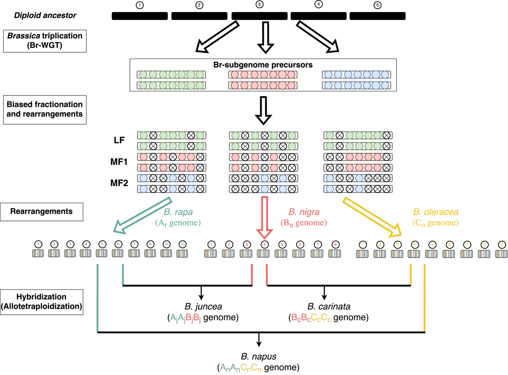

# Brassica-Subgenome-Dominance

Two axes of subgenome dominance across the *Brassica* U's triangle: the structural asymmetry
between subgenomes is inherited from the diploid progenitors, while the expression bias between
homoeologs is largely rebuilt inside the hybrid. This repository accompanies the paper and
contains every script that turns the processed counts into the figures and tables of the
manuscript.

<p align="center"></p>

The three allotetraploids of the U's triangle arose from independent allopolyploidizations of the
same three diploid genomes, so each genome occurs in two hybrids with a different partner each
time. That is what lets a feature of a *genome* be told apart from a feature of a *pairing*.

## What the analysis concludes

- Three pairings resolve to one order: **B is dominant wherever it occurs** and **C is
  non-dominant wherever it occurs**, across five fold-change thresholds and both mapping-quality
  settings. A is intermediate and tissue-dependent.
- **Structural asymmetry is inherited.** Each subgenome carries its own gene-proximal LTR density
  and its own K~a~/K~s~ into both hybrids containing it, agreeing to within 4-9%. The difference
  between the two *napus* subgenomes (1.46-fold) is the difference their progenitors already had
  (1.45-fold).
- **Expression bias is largely rebuilt.** The parental difference explains only 8-21% of the bias
  inside the hybrid, parental bias is dampened (slope 0.23-0.44), and allopolyploidy erases more
  bias than it creates. Stigma remodels more than pollen in every species.
- **No structural proxy predicts which homoeolog is suppressed gene by gene.** Flanking LTR
  density, centromere distance and K~a~/K~s~ (after controlling for the expression-rate
  anticorrelation) all give |rho| <= 0.05, while the same measures separate subgenomes 1.5- to
  2.1-fold on average.

## Layout

- `SUPPLEMENTARY.md` supplementary figures and tables, with the tables inline
- `figures/`
  - `style.py` one shared matplotlib style; fixed colour per genome (A blue, B vermilion,
    C green) so a genome is the same colour in every figure, tissue carried by marker
  - main figures, one script per figure, each named for the figure it writes:
    - `make_fig2_structure.py` structural asymmetry between the Allo-subgenomes, the diploid
      progenitors on one transposon library, and the four features on a shared axis
    - `make_fig3_scoreboard.py` the dominance scoreboard with exact binomial tests and Wilson
      intervals, at five thresholds
    - `make_fig4_inheritance.py` allotetraploid bias against progenitor bias; slope, R2 and the
      four-way split
    - `make_fig5_genelevel.py` the three paired structural tests, with the subgenome-level contrast
    - `make_fig6_novel_bias.py` where the lean comes from; class sizes and the per-class ratios
    - `make_fig7_brsubgenome.py` the dominance ratio inside each Br-subgenome layer
    - `make_fig8_enrichment.py` GO enrichment among the novel-or-switched genes, in stigma
  - supplementary figures:
    - `make_supplementary.py` Figures S1, S3, S4, S12, S13, S18 and S19
    - `make_figS_ordination.py` Figure S2
    - `make_figS_he_dosage.py` Figure S5
    - `make_figS_structure.py` Figures S6, S7 and S8
    - `make_figS_exchanges.py` Figure S9
    - `make_figS_exchange_links.py` Figure S10
    - `make_figS_remaining.py` Figures S11, S15 and S20
    - `make_figS_pergene_ltr.py` Figures S14 and S17
    - `make_figS16_coexpr.py` Figure S16
  - `Fig1_evolutionary_relationships.png` the schematic (also `Fig1_hero.png`, downscaled)
  - `extra_*` plots that were produced during the analysis but are not in the manuscript
- `tables/`
  - `make_tables.py` builds all four main tables as TSV and markdown
- `pipeline/` the analysis scripts, numbered in run order; see `pipeline/README.md`

## Reproducing the figures and tables

```bash
cd figures && for f in make_fig*.py make_supplementary.py; do python3 "$f"; done
cd ../tables && python3 make_tables.py
```

Both read the analysis outputs by relative path (`../expression_rebuild/...`), so that directory
must be present alongside this repository, or the paths adjusted at the top of each script. Every figure writes a `.png` and a `.pdf`; PDF text is editable (fonttype 42).

## Dependencies

Python 3 with numpy, pandas, scipy, scikit-learn, statsmodels, matplotlib and Pillow; R with
DESeq2 for the bias and inheritance analyses. The evolutionary metrics additionally use SynMap
output from the CoGe platform, RepeatMasker with a common TE library for the LTR annotations, and
BWA-MEM and featureCounts upstream.

## Data

Processed count matrices and the conserved homoeologous gene set are produced by the pipeline in
`pipeline/`. Raw sequencing reads are deposited under accession *[to be completed]*.

## Repository and citation

```bash
git clone https://github.com/USask-BINFO/Brassica-Subgenome-Dominance.git
```

The supporting figures and tables are in [`SUPPLEMENTARY.md`](SUPPLEMENTARY.md). The manuscript
itself is not distributed here while it is unpublished; every value it reports is reproduced by
the scripts in `pipeline/` and tabulated in `SUPPLEMENTARY.md`.

Two further repositories hold analysis this one calls out to:

| what | where |
|:-|:-|
| SynMap parsing, Gaussian-mixture fitting of K~s~, fractionation ratio, centromere distance | https://git.cs.usask.ca/lij313/analyzecoge |
| sequence similarity and K~s~ for orthologous gene pairs | https://git.cs.usask.ca/lij313/evolv |

Citation details will be added once the paper is published.
