# Two axes of subgenome dominance across the U's triangle - Supplementary Materials

Supporting figures, tables and validations for the main text. Every value traces to a script in
`pipeline/`; the full analysis record is in
`docs/RESULTS_rebuild.md`.

## Abbreviations and terms

| term | meaning |
|:-|:-|
| Allo-subgenome | a subgenome of an allotetraploid, contributed by one diploid progenitor (A~n~, C~n~, A~j~, B~j~, B~c~, C~c~) |
| Br-subgenome | one of the three subgenomes left by the *Brassica* triplication: LF, MF1, MF2 |
| Gref | the conserved homoeologous gene set of 27,203 *A. thaliana*-anchored syntenic genes |
| gene copy / homoeolog pair | one Gref anchor in one Br-subgenome layer; 27,203 x 3 = 81,609 are possible, and that fixed total is the denominator for copy-level and pair-level percentages |
| HEB | homoeologous expression bias, the lean of biased homoeolog pairs toward one subgenome |
| ELD | expression-level dominance, the behaviour of a pair's TOTAL expression relative to the progenitors |
| homoeolog pair | the two Allo-subgenome copies of one Gref entry inside one allotetraploid |
| θ (theta) | the log~2~ fold-change threshold used in the equivalence test (θ = 1 is two-fold) |
| dominant subgenome | in a sample, the subgenome toward which more biased pairs lean |
| LTR density | fraction of the 5 kb either side of a gene covered by an annotated long terminal repeat |

---

## Supplementary Figures

### Figure S1. Replicate correlation, all 39 libraries

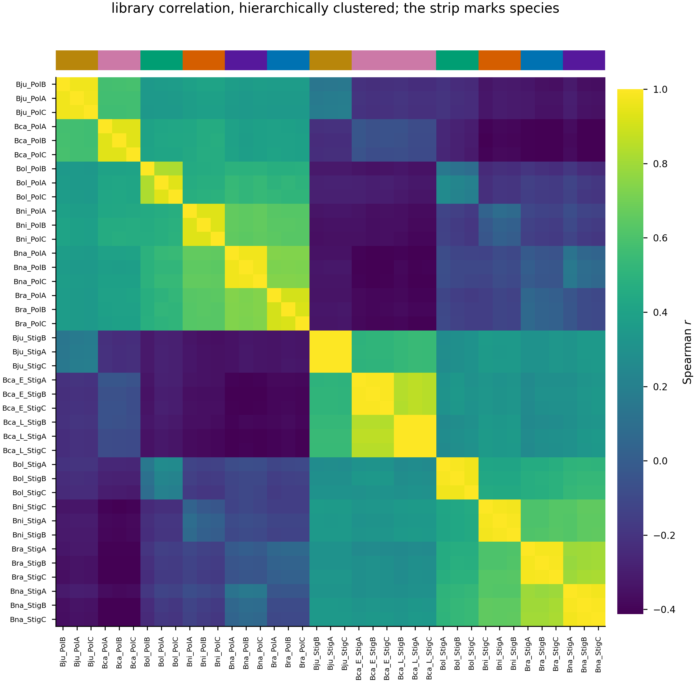

Pairwise Spearman correlation between libraries, ordered by species and tissue. Replicates of a library group together and tissue separates before species, confirming that the replicate structure is sound before any bias is called.

### Figure S2. Ordination of the libraries and clustering of the subgenome profiles

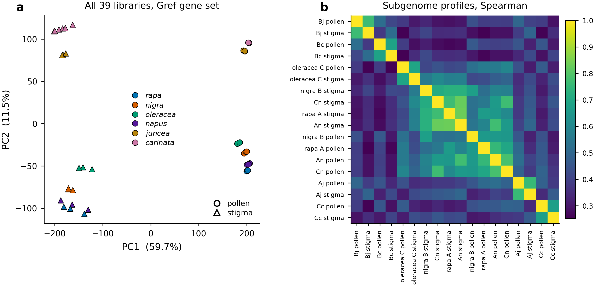

(**a**) Principal component analysis of all 39 libraries on the conserved homoeologous gene set.
Expression is summed over the subgenomes of each library, so a diploid and an allotetraploid are
compared per gene rather than per gene copy, and every species is scored on the same orthologous
genes; a PCA on each species' own annotation would put annotation size on the first axis. Counts
were converted to CPM, log~2~-transformed, and the 2,000 most variable genes retained. PC1 takes
59.7% of the variance and separates pollen from stigma; PC2 takes 11.5% and separates the
species. Replicates of a library sit together throughout. (**b**) Spearman correlation between
the mean profile of each subgenome track within each tissue, ordered by average linkage on
1 - r. Some tracks pair their own two tissues, while *rapa* A, *nigra* B, A~n~ and C~n~ instead
group by tissue, so the tissue contrast is comparable in size to the difference between
subgenomes. This is the same property that makes co-expression unidentifiable in this design
(Figure S16). Generated by `figures/make_figS_ordination.py`.

### Figure S3. Expressed gene copies per species and tissue

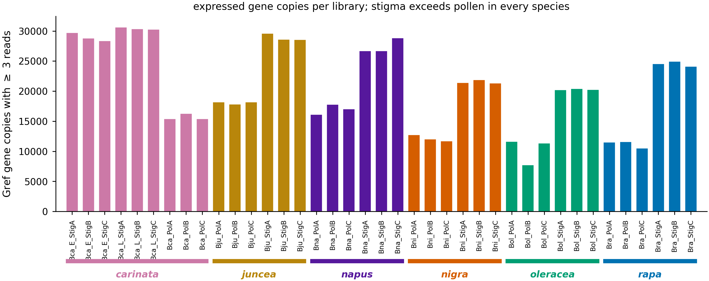

Number of expressed Gref gene copies, by species, subgenome and tissue. A copy counts as expressed at three or more reads summed over the three replicates. Stigma expresses more gene copies than pollen in every species. Alignment rates per library are in Table S1 and the counts behind this panel are in Table S2.

### Figure S4. Mapping-bias simulation

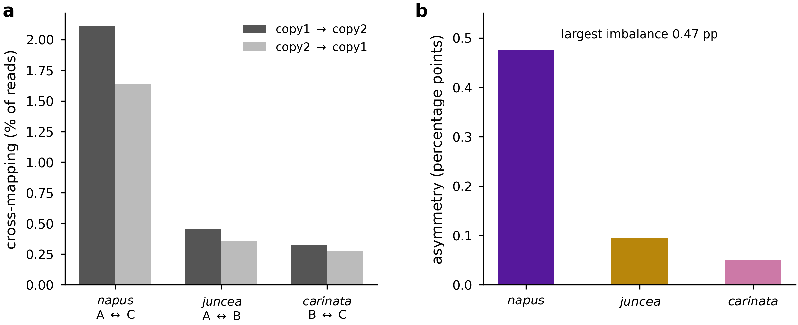

(**a**) Cross-mapping between the two subgenomes of each allotetraploid: the share of simulated
reads that originate in one subgenome and whose primary alignment lands on a chromosome of the
other. (**b**) The difference between the two directions. Generated by
`pipeline/34_mapping_bias_simulation.py`.

### Figure S5. Missing homoeolog runs are gene loss, not homoeologous exchange

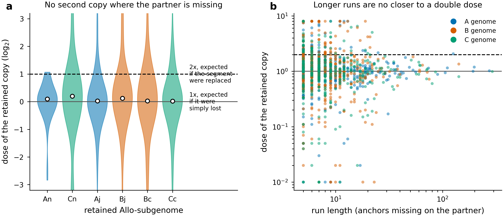

Homoeologous exchange replaces a stretch of one subgenome with a second copy of its homoeologue,
so the retained side ends up carrying two loci and should read about twice its usual level. Plain
fractionation deletes the stretch and leaves the retained side unchanged. Dose is measured on the
**same** anchors in the diploid progenitor of the retained subgenome and normalised by the
genome-wide ratio between the two, so gene identity and library depth both cancel.
(**a**) Dose for every run of at least five consecutive anchors whose copy is missing from the
partner subgenome. All six medians lie between 1.02 and 1.15; none approaches 2.
(**b**) The same runs against their length. A long run is a more confident call, and the dose
converges on 1 rather than 2 as runs lengthen. Generated by
`pipeline/50_he_dosage_test.py` from the runs called by `pipeline/49_he_presence_runs.py`.

---

### Figure S6. Gene retention, measured two ways

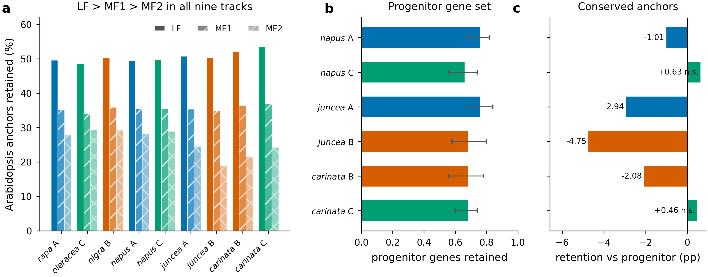

(**a**) Share of the 27,203 *Arabidopsis* anchor genes retained in each layer of each track. The
LF > MF1 > MF2 ordering left by the *Brassica* triplication is intact in all nine. (**b**) Share
of each diploid progenitor's own genes that still carry a syntenic partner in the Allo-subgenome,
as the median over non-overlapping 50-gene bins along the progenitor chromosomes, with the
interquartile range. (**c**) The same contrast on the conserved anchor set of (**a**), as the
difference from the progenitor in percentage points.

The two measures do not agree, and the paper reports (**b**). Against the progenitor gene set,
A~n~ retains more than C~n~ (0.760 against 0.660, p = 6 x 10^-58^) and A~j~ more than B~j~ (0.760
against 0.680, p = 3 x 10^-31^), while *carinata* does not separate (0.680 against 0.680,
p = 0.34). Against the conserved anchors every Allo-subgenome sits close to its progenitor and
the small deficits fall on A~n~, A~j~ and B~j~ instead. The anchor set holds only genes conserved
to *Arabidopsis*, where loss is rare, so it compresses the contrast; the progenitor gene set is
the broader measure, but its denominator differs between progenitors, *oleracea* carrying 59,225
annotated genes against *rapa*'s 45,887. On neither measure does retention stand in a consistent
relationship with the expression lean.

### Figure S7. Chromosomal collinearity with the progenitor

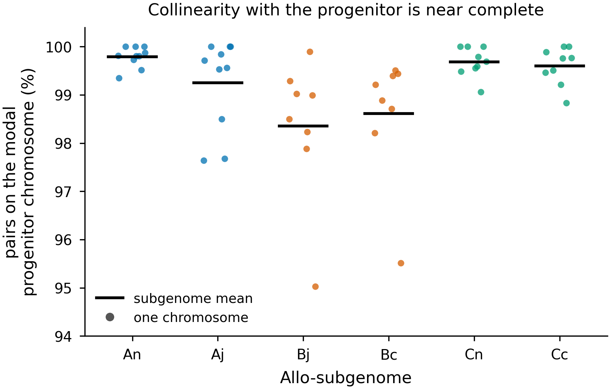

For each Allo chromosome, the share of its recent syntenic gene pairs that land on its single most-aligned progenitor chromosome. A chromosome involved in a rearrangement spreads its pairs over more than one progenitor chromosome and this share falls. Collinearity is between 98.4% and 99.8% in every subgenome, so gross rearrangement is not what separates them. Measured on the recent blocks only, because the ancient triplication paralogy that SynMap also reports otherwise swamps the orthologous diagonal.

### Figure S8. Sequence divergence from the progenitor

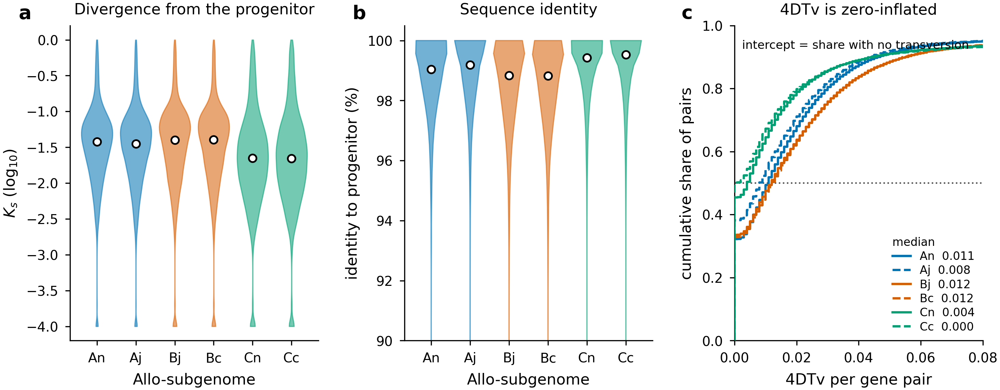

(**a**) Distribution of per-pair K~s~ over the recent allotetraploidization blocks for each Allo-subgenome; the white dot is the median quoted in Table S5. (**b**) Distribution of percent identity to the progenitor, again with the median. (**c**) Cumulative distribution of per-pair 4DTv. The curve for each subgenome starts at the share of pairs with no transversion at an informative fourfold-degenerate codon, from 32.2% in A~n~ to 50.2% in C~c~, and crosses the dotted line at the median given in the legend and in Table S5. Solid and dashed lines separate the two subgenomes of each genome. The axis is cut at 0.08, above which the remaining pairs are those with too few informative codons to estimate 4DTv reliably. The two C subgenomes carry the fewest transversions and the two B subgenomes the most, ordering the genomes B > A > C. Summary values are in Table S5.

### Figure S9. Homoeologous exchanges with the diploid progenitor

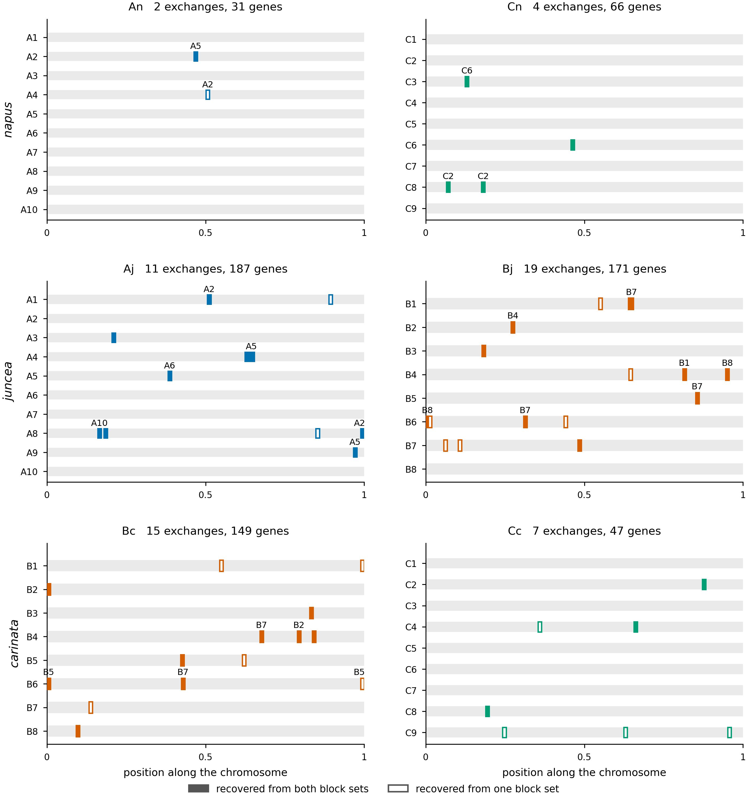

Every chromosome of each Allo-subgenome is drawn as a bar along its own gene order, with position
expressed as a fraction of the genes on that chromosome. A segment is marked where an
uninterrupted run of at least five genes sits on a progenitor chromosome other than the one
holding the rest of that chromosome, and the label names the donating chromosome for runs of ten
genes or more. Filled segments were recovered from both block sets and outlined segments from one.
The *Brassica* triplication puts every Allo region against two further progenitor regions, and
those matches are also off-diagonal, so a gene is assigned only when its best partner reaches 95%
identity: within one comparison the orthologous partner runs at about 98.6% and the paralogous
matches near 80.6%, which separates them cleanly. *napus* carries the fewest exchanges of the
three, 2 in A~n~ and 4 in C~n~, against 11 and 19 in *juncea* and 15 and 7 in *carinata*. Counts
are in Table S7 and the full list of runs, with the flanking genes of each, is in
`tables/exchanges.csv`. Generated by `pipeline/47_homoeologous_exchanges.py` and
`figures/make_figS_exchanges.py`.

### Figure S10. Where each exchanged segment came from and where it landed

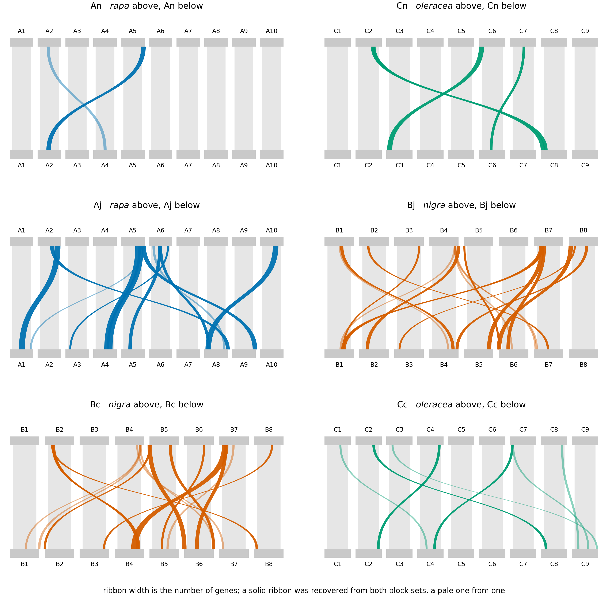

The diploid progenitor's chromosomes are set on the upper row against the Allo-subgenome's on the
lower row, drawn as equal-width schematics with position expressed as a fraction of the genes on
that chromosome. The pale backbone joins every Allo chromosome to the progenitor chromosome
holding most of its genes; each coloured ribbon is one exchanged run, drawn from the segment it
matches on the progenitor to the place it occupies in the Allo-subgenome, with width set by the
number of genes and full colour where both block sets recovered it. Every donor is a chromosome
of the same genome as the recipient, so what is shown is rearrangement between a subgenome and
its own progenitor rather than exchange between the two subgenomes sharing a nucleus. The runs
are mostly not reciprocal, 6 of 47 chromosome pairs having a counterpart in the other direction,
and they are not concentrated toward the chromosome ends, with 26% in the outer fifth against 20%
expected (binomial p = 0.17; Kolmogorov-Smirnov against uniform p = 0.19), so they do not carry
the signature of crossover-driven exchange. Generated by `figures/make_figS_exchange_links.py`
from the same calls as Figure S9.

### Figure S11. Expression-level dominance and the inheritance patterns

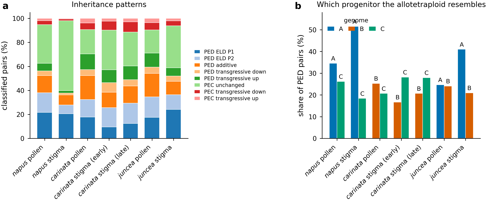

(**a**) Share of classified homoeolog pairs in each inheritance pattern, per sample. PED marks a parental expression difference and PEC no such difference; within each, the pair's total expression is classified as resembling one progenitor (ELD), additive, or transgressive. (**b**) Of the pairs showing dominance, the share resembling each progenitor, coloured by that progenitor's genome. Counts are in Table S9b.

### Figure S12. Inheritance of bias, all seven species-tissue combinations

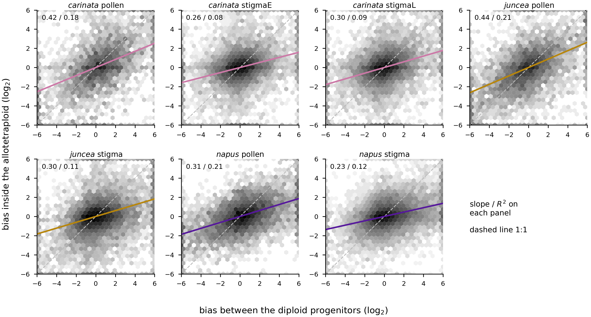

Allotetraploid bias against progenitor bias for every sample rather than the three shown in the main text, with the fitted slope and R^2^ on each panel.

### Figure S13. The expression-rate control on K~a~/K~s~

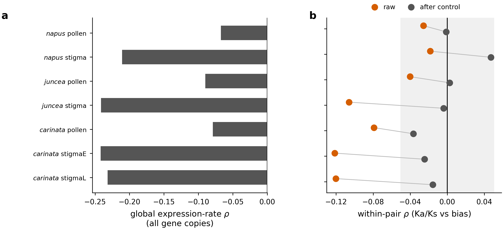

The global relationship between a gene copy's expression and its K~a~/K~s~, fitted by LOWESS, and the effect of removing it from the within-pair test. Between 54% and 96% of the apparent association is accounted for by this confounder.

### Figure S14. Per-gene bias across samples

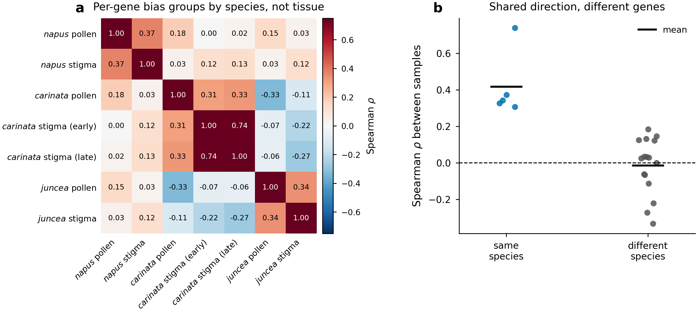

(**a**) Spearman correlation of the per-gene bias log~2~ fold change between every pair of samples. (**b**) The same values split by whether the two samples are the same species. Bias correlates within a species and barely at all between species, so the two C-carrying allotetraploids lean the same way without using the same genes.

### Figure S15. The dominance ratio within each Br-subgenome layer

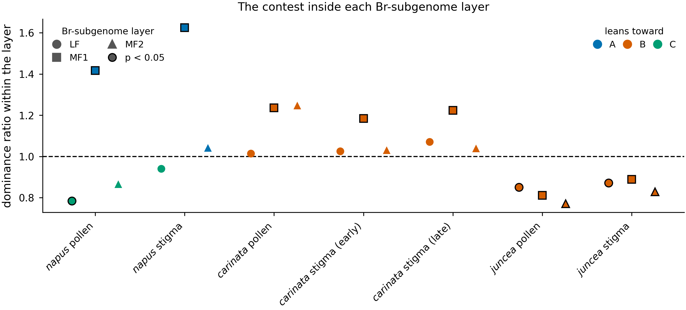

Dominance ratio computed separately inside the LF, MF1 and MF2 layers of the *Brassica* triplication. Colour marks the genome the layer leans toward and a black outline marks p < 0.05. *napus* pollen is the informative case: LF leans to C and MF1 leans to A, and the two cancel, which is why the whole-sample contest does not resolve. Values are in Table S11b.

### Figure S16. Why co-expression is not identifiable in this design

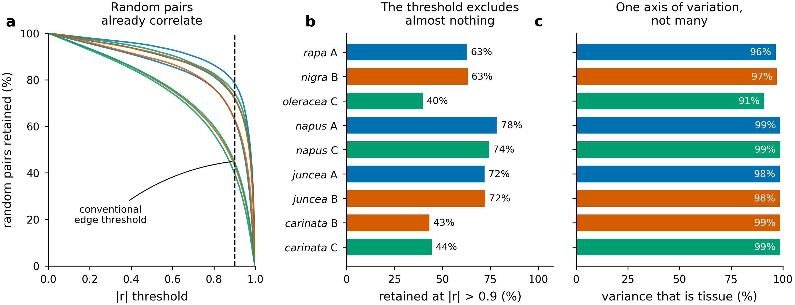

Each subgenome track carries six libraries, three pollen and three stigma, nine for *carinata*. (**a**) Fraction of randomly chosen gene pairs correlating above each |r| threshold. (**b**) At |r| > 0.9, a conventional edge threshold, 40% to 78% of *random* gene pairs are retained. (**c**) Between 91% and 99% of a gene's variance across a track's libraries is the tissue contrast. With one dominant axis of variation a correlation records whether two genes respond to tissue alike, not whether they are co-regulated, so the network is a tissue dichotomy. Co-expression was therefore not pursued.

### Figure S17. Gene-proximal LTR density per Br-subgenome layer

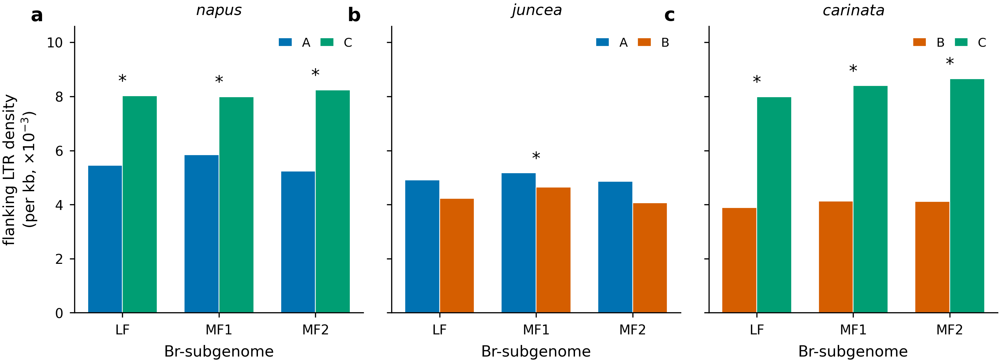

Mean flanking LTR density of each subgenome's copies, within each layer of the triplication. An asterisk marks p < 0.05 by Wilcoxon signed-rank on the within-pair difference. The C subgenome carries the higher density in every layer of *napus* and *carinata*; in *juncea* the A and B difference is weak. Density does not follow the LF > MF1 > MF2 retention hierarchy, so the two are not the same axis.

### Figure S18. The gene-level tests, with the sensitivity analyses

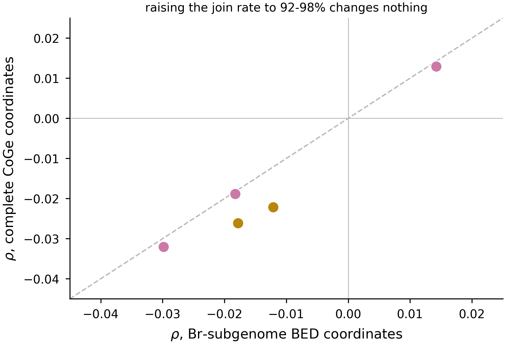

Flanking LTR density against bias computed from two independent gene-coordinate sources, the project annotation and the CoGe annotation, to show the gene-level correlation does not depend on which coordinates are used.

### Figure S19. Sensitivity of the dominance scoreboard to analysis choices

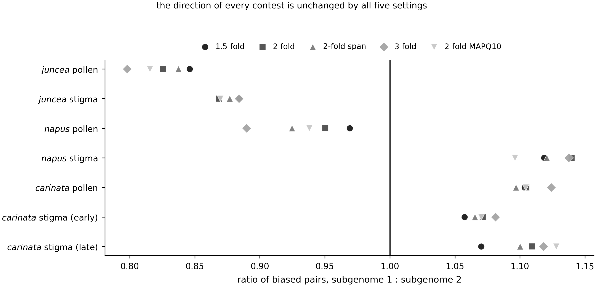

The dominance ratio of every sample at each analysis setting: 1.5-fold, two-fold (the primary analysis), three-fold, gene-span counting instead of CDS, and a MAPQ >= 10 filter. The direction of every resolved contest is the same at all five settings. The underlying numbers are in Table S8 and the primary analysis in full is in Table S8b.

### Figure S20. Functional enrichment, full heatmaps

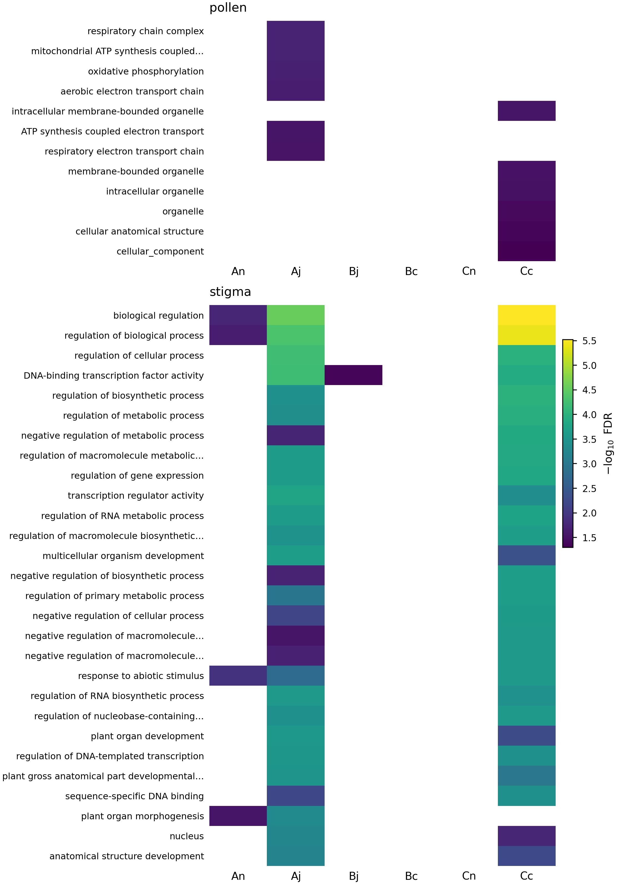

Enrichment among genes with novel or switched bias, both tissues rather than stigma alone. Colour is -log~10~ FDR on a scale shared by the two panels; a blank cell is a term not significant in that subgenome. Terms were tested by Fisher's exact test on the propagated gene ontology with Benjamini-Hochberg control and restricted to terms covering 10 to 400 genes. The pollen signal in A~j~ is mitochondrial, not photosynthetic.

## Supplementary Tables

### Table S1. Alignment rates per library

Computed from the BAM files. The BAMs carry no index, so each of
the 39 libraries was streamed once and its SAM flags tallied the way `samtools flagstat` does:
QC-passed records are those without the 0x200 flag, with secondary and supplementary alignments
included and the two mates of a pair counted separately; mapped records are those without the
0x4 flag. Alignment rate is mapped / QC-passed. Regenerated by
`pipeline/29_table_s1_alignment.py`.

| species | tissue | replicate | library | QC-passed records | mapped | alignment rate (%) |
|:-|:-|:-|:-|-|-|-|
| *rapa* | pollen | A | `Bra_PolA` | 37,258,582 | 32,670,569 | 87.69 |
| *rapa* | pollen | B | `Bra_PolB` | 45,448,455 | 41,285,470 | 90.84 |
| *rapa* | pollen | C | `Bra_PolC` | 26,404,473 | 23,793,729 | 90.11 |
| *rapa* | stigma | A | `Bra_StigA` | 70,164,002 | 67,299,192 | 95.92 |
| *rapa* | stigma | B | `Bra_StigB` | 97,132,248 | 93,210,377 | 95.96 |
| *rapa* | stigma | C | `Bra_StigC` | 88,725,778 | 85,515,660 | 96.38 |
| *nigra* | pollen | A | `Bni_PolA` | 42,133,434 | 41,472,067 | 98.43 |
| *nigra* | pollen | B | `Bni_PolB` | 37,194,232 | 36,626,680 | 98.47 |
| *nigra* | pollen | C | `Bni_PolC` | 35,783,913 | 35,247,668 | 98.50 |
| *nigra* | stigma | A | `Bni_StigA` | 34,363,102 | 33,657,358 | 97.95 |
| *nigra* | stigma | B | `Bni_StigB` | 42,435,516 | 41,723,039 | 98.32 |
| *nigra* | stigma | C | `Bni_StigC` | 43,439,062 | 42,651,039 | 98.19 |
| *oleracea* | pollen | A | `Bol_PolA` | 30,636,907 | 30,184,351 | 98.52 |
| *oleracea* | pollen | B | `Bol_PolB` | 16,144,884 | 13,865,876 | 85.88 |
| *oleracea* | pollen | C | `Bol_PolC` | 25,972,510 | 25,566,056 | 98.44 |
| *oleracea* | stigma | A | `Bol_StigA` | 25,581,826 | 24,757,155 | 96.78 |
| *oleracea* | stigma | B | `Bol_StigB` | 24,652,409 | 23,942,889 | 97.12 |
| *oleracea* | stigma | C | `Bol_StigC` | 27,069,121 | 26,335,503 | 97.29 |
| *napus* | pollen | A | `Bna_PolA` | 92,646,492 | 92,102,078 | 99.41 |
| *napus* | pollen | B | `Bna_PolB` | 120,330,880 | 119,658,168 | 99.44 |
| *napus* | pollen | C | `Bna_PolC` | 117,831,823 | 116,687,004 | 99.03 |
| *napus* | stigma | A | `Bna_StigA` | 110,776,518 | 109,190,886 | 98.57 |
| *napus* | stigma | B | `Bna_StigB` | 96,881,976 | 93,160,348 | 96.16 |
| *napus* | stigma | C | `Bna_StigC` | 101,646,357 | 100,280,199 | 98.66 |
| *juncea* | pollen | A | `Bju_PolA` | 95,239,557 | 94,558,309 | 99.28 |
| *juncea* | pollen | B | `Bju_PolB` | 106,374,781 | 105,701,120 | 99.37 |
| *juncea* | pollen | C | `Bju_PolC` | 108,717,794 | 107,454,002 | 98.84 |
| *juncea* | stigma | A | `Bju_StigA` | 120,262,249 | 117,437,855 | 97.65 |
| *juncea* | stigma | B | `Bju_StigB` | 92,424,577 | 90,880,479 | 98.33 |
| *juncea* | stigma | C | `Bju_StigC` | 105,114,680 | 102,906,989 | 97.90 |
| *carinata* | pollen | A | `Bca_PolA` | 53,989,018 | 52,630,420 | 97.48 |
| *carinata* | pollen | B | `Bca_PolB` | 75,046,072 | 73,045,965 | 97.33 |
| *carinata* | pollen | C | `Bca_PolC` | 50,356,917 | 48,990,475 | 97.29 |
| *carinata* | stigma (early) | A | `Bca_E_StigA` | 83,851,192 | 82,352,027 | 98.21 |
| *carinata* | stigma (early) | B | `Bca_E_StigB` | 72,824,950 | 71,334,773 | 97.95 |
| *carinata* | stigma (early) | C | `Bca_E_StigC` | 76,260,648 | 74,259,136 | 97.38 |
| *carinata* | stigma (late) | A | `Bca_L_StigA` | 139,154,800 | 138,730,170 | 99.69 |
| *carinata* | stigma (late) | B | `Bca_L_StigB` | 144,389,928 | 143,798,593 | 99.59 |
| *carinata* | stigma (late) | C | `Bca_L_StigC` | 143,747,414 | 143,341,203 | 99.72 |

Alignment rate ranges from 85.9% (`Bol_PolB`) to 99.7% (`Bca_L_StigC`) over the 39 libraries, and the total
is 2,858,409,077 QC-passed records. Both reproduce the values carried in the main text.

### Table S2. Expressed gene copies per species and tissue

A gene copy counts as expressed when its three replicates of a tissue sum to at least three
reads. The unit here is the gene COPY, that is one *Arabidopsis* anchor in one Br-subgenome
layer of one subgenome track, so the fixed denominator is 27,203 anchors x 3 layers = 81,609
possible copies. That denominator is the same for every row and includes loci with no
annotated copy, matching the convention used for the whole-transcriptome percentages in the
Methods. The last column gives the conditional rate among copies that exist. Stigma expresses
more copies than pollen in every species. Regenerated by `pipeline/30_tables_s2_s9.py`.

| species | subgenome | tissue | copies present | expressed | % of 81,609 | % of present |
|:-|:-|:-|-|-|-|-|
| *rapa* | A | pollen | 30,575 | 14,136 | 17.3 | 46.2 |
| *rapa* | A | stigma | 30,575 | 26,812 | 32.9 | 87.7 |
| *nigra* | B | pollen | 31,354 | 15,080 | 18.5 | 48.1 |
| *nigra* | B | stigma | 31,354 | 23,441 | 28.7 | 74.8 |
| *oleracea* | C | pollen | 30,460 | 13,866 | 17.0 | 45.5 |
| *oleracea* | C | stigma | 30,460 | 22,669 | 27.8 | 74.4 |
| *napus* | A | pollen | 30,767 | 16,878 | 20.7 | 54.9 |
| *napus* | A | stigma | 30,767 | 26,612 | 32.6 | 86.5 |
| *napus* | C | pollen | 31,019 | 16,867 | 20.7 | 54.4 |
| *napus* | C | stigma | 31,019 | 26,698 | 32.7 | 86.1 |
| *juncea* | A | pollen | 29,957 | 16,010 | 19.6 | 53.4 |
| *juncea* | A | stigma | 29,957 | 25,229 | 30.9 | 84.2 |
| *juncea* | B | pollen | 28,229 | 15,485 | 19.0 | 54.9 |
| *juncea* | B | stigma | 28,229 | 23,826 | 29.2 | 84.4 |
| *carinata* | B | pollen | 29,931 | 13,295 | 16.3 | 44.4 |
| *carinata* | B | stigma (early) | 29,931 | 23,875 | 29.3 | 79.8 |
| *carinata* | B | stigma (late) | 29,931 | 24,001 | 29.4 | 80.2 |
| *carinata* | C | pollen | 31,197 | 13,665 | 16.7 | 43.8 |
| *carinata* | C | stigma (early) | 31,197 | 24,791 | 30.4 | 79.5 |
| *carinata* | C | stigma (late) | 31,197 | 24,811 | 30.4 | 79.5 |

### Table S3. Mapping-bias simulation

500,000 error-free 151 bp reads, the library read length, were drawn uniformly from the gene
spans of **each** subgenome and mapped back to the same reference with the same aligner the
libraries used (`bwa mem`, default settings). Equal numbers from each subgenome mean that an
imbalance in the recovered reads can only come from the reference. Error-free reads are the
conservative choice here: sequencing errors can only reduce the chance that a read matches the
homoeologous copy better than its own.

| species | contrast | copy1 -> copy2 | copy2 -> copy1 | asymmetry | which subgenome gains | runs with the lean? |
|:-|:-|:-|:-|:-|:-|:-|
| *napus* | A <-> C | 2.109% | 1.634% | +0.475 pp | C~n~ | no, against it |
| *juncea* | A <-> B | 0.454% | 0.360% | +0.094 pp | B~j~ | yes |
| *carinata* | B <-> C | 0.324% | 0.274% | +0.050 pp | C~c~ | no, against it |

Cross-mapping is 0.27% to 2.11%, highest in *napus*, whose A and C subgenomes are the most
similar pair. The two directions are not perfectly balanced, and the largest imbalance, 0.475
percentage points in *napus*. What matters is its direction. In *napus* and *carinata* the imbalance inflates the subgenome
that the expression analysis finds **non**-dominant, so it works against the observed lean and
cannot have produced it. *juncea* is the one case where it runs with the lean, inflating B~j~,
but the net transfer is 0.094% of reads against an observed excess of 21% more B-leaning pairs
than A-leaning: too small by a factor of about 225. No dominance call in this paper is
attributable to mapping bias. Generated by `pipeline/34_mapping_bias_simulation.py`.

### Table S4. Test for homoeologous exchange between the two subgenomes

Walking each Arabidopsis anchor along a chromosome of one subgenome, the question is whether the
other subgenome sharing that nucleus still carries a copy. A run of consecutive anchors with no
copy on the partner is where a segment is missing, which is what an exchange would leave behind.
Dose then separates exchange from ordinary loss (Figure S5).

| retained subgenome | anchors | missing from the partner | runs of >= 5 | anchors in runs | median dose |
|:-|-|-|-|-|-|
| A~n~ | 30,767 | 2,543 (8.3%) | 50 | 746 | 1.07 |
| C~n~ | 31,019 | 2,795 (9.0%) | 37 | 458 | 1.15 |
| A~j~ | 29,957 | 7,831 (26.1%) | 385 | 4,950 | 1.02 |
| B~j~ | 28,229 | 6,073 (21.5%) | 308 | 2,721 | 1.09 |
| B~c~ | 29,931 | 7,655 (25.6%) | 400 | 3,820 | 1.02 |
| C~c~ | 31,197 | 8,921 (28.6%) | 448 | 5,107 | 1.02 |

**No exchange is detected in any of the three allotetraploids.** Segments missing from one
subgenome are common, but the partner carries a single dose across all of them, so they are gene
loss rather than replacement. A second test gives the same answer from the opposite direction:
asking instead for homoeolog pairs where one copy is annotated but reads zero in every library
of that species while its partner stays expressed finds 369 to 729 such pairs per species, and
almost none of them fall in runs, so the silencing is gene by gene rather than segmental
(`pipeline/48_homoeologous_exchange_HE.py`).

This matters for the expression results: homoeologous exchange is the standard alternative
explanation for homoeologous expression bias, because a replaced segment makes one subgenome
look uniformly silenced, and it does not apply here. The missing-copy share is also much lower
in *napus*, 8 to 9% against 21 to 29% in the other two, which follows the annotation sizes of
the assemblies rather than anything about dominance (Table S6A).
Generated by `pipeline/49_he_presence_runs.py` and `pipeline/50_he_dosage_test.py`.

---
### Table S5. Comparative evolutionary metrics

Per Allo-subgenome against its diploid progenitor.

| subgenome | median K~s~ | median 4DTv | median identity (%) | K~a~/K~s~ | mean gene pairs per block |
|:-|:-|:-|:-|:-|:-|
| A~n~ | 0.0376 | 0.011 | 99.04 | 0.1825 | 334.56 |
| A~j~ | 0.0355 | 0.008 | 99.19 | 0.1843 | - |
| B~j~ | 0.0398 | 0.012 | 98.84 | 0.1967 | - |
| B~c~ | 0.0405 | 0.012 | 98.82 | 0.1921 | 169.03 |
| C~n~ | 0.0222 | 0.004 | 99.43 | 0.2783 | 193.48 |
| C~c~ | 0.0220 | 0.000 | 99.53 | 0.2893 | 186.52 |

**Notes on the statistics.** Mean gene pairs per block is computed with block identity windows
of 80-95% and 95-100%, scaffold blocks dropped, and a K~s~ filter of 0.001 <= K~s~ <= 4;
syntenic-block merging is not used. The value reported per subgenome as K~s~ is the **median** of
per-pair K~s~ with K~s~ <= 1. Fitting a Gaussian mixture to the same distributions and taking the
heaviest component instead gives values 1.34 to 1.70 times higher, so the two statistics are not
interchangeable. 4DTv is reported as the **median** of per-pair values over the same recent blocks, computed from 31,221 to 38,254 gene pairs per comparison. The median is the statistic that orders the
genomes B > A > C, pooling the two subgenomes of each genome: 0.012 for B, 0.010 for A and
0.003 for C. The per-pair mean and the mean over block means each give a different order, so
the statistic is not interchangeable. The distribution is strongly zero-inflated, because the
subgenomes closest to their progenitors retain few transversions at fourfold-degenerate sites.
The share of pairs with no transversion at any informative fourfold-degenerate codon runs from
32.2% in A~n~ to 50.2% in C~c~, and it is that last figure which puts the C~c~ median at exactly
0.000 (Figure S8c).
Sequence identity is reported as the **median** of per-pair percent identity over the same
recent blocks. It is stable across the identity window: the two C subgenomes are the highest of the six in all
eight windows from 80-100 to 95-100, and from 91-100 through 95-100 the six values move by at
most 0.01. Widening to 88-100 moves them by at most 0.13 and leaves the ordering unchanged;
only 80-100, which admits the ancient triplication layer, reorders anything, and there it moves
A~n~ below the two B subgenomes. A trimmed mean shifts the six values by less than 0.06 at a 4-5% trim, but the trim fraction is
a free parameter and the median needs none, so the median is the value quoted.
Like K~s~ and 4DTv, identity follows the genome and the reference rather than the lean.

### Table S6. DCJ distance on a common Arabidopsis framework

**(A) Why a common framework is needed.** Each Allo-subgenome is compared with its own diploid
progenitor, but taking the markers from that progenitor's own annotation makes the distance a
property of the annotation rather than of the subgenome. The *rapa* annotation carries about
13,600 fewer genes than the other two and yields roughly half as many breaks in local gene order
per anchor, so any subgenome measured against *rapa* records a lower distance whatever its
structure. Distances built that way cluster by progenitor rather than by subgenome, and the
spread between progenitors is 7.1 times the spread within one.

| subgenome | progenitor | genes in the progenitor annotation | order breaks per 1,000 anchors |
|:-|:-|-|-|
| A~n~ | *rapa* | 46,250 | 4.71 |
| A~j~ | *rapa* | 46,250 | 5.69 |
| B~j~ | *nigra* | 59,851 | 10.35 |
| B~c~ | *nigra* | 59,851 | 9.48 |
| C~n~ | *oleracea* | 59,225 | 9.43 |
| C~c~ | *oleracea* | 59,225 | 9.13 |

**(B) The framework used in Table 3.** Markers were built on the Gref anchor set, identical for
all six subgenomes: each Arabidopsis anchor names at most one gene per Br-subgenome layer in the
Allo-subgenome and at most one in the diploid, so the correspondence is one-to-one by
construction and no paralogy has to be filtered. Maximal collinear runs of those anchor pairs are
the signed markers, and the minimum run length is the one free parameter. On this framework the
marker counts no longer cluster by progenitor; the ratio of between-progenitor to
within-progenitor spread falls from 7.1 to 0.67. Table 3 reports a minimum run of 30, and all
three orderings hold at every run length from 28 to 45. Cells give the distance with the marker
count in parentheses.

| minimum run | A~n~ | A~j~ | B~j~ | B~c~ | C~n~ | C~c~ | *napus* | *carinata* | *juncea* |
|:-|-|-|-|-|-|-|:-|:-|:-|
| 2 | 30 (74) | 385 (562) | 729 (1001) | 754 (1064) | 94 (154) | 863 (1193) | A~n~ < C~n~ | B~c~ < C~c~ | fails |
| 3 | 26 (72) | 289 (455) | 528 (760) | 547 (814) | 83 (142) | 579 (908) | A~n~ < C~n~ | B~c~ < C~c~ | fails |
| 5 | 25 (70) | 183 (348) | 325 (512) | 350 (572) | 74 (132) | 355 (620) | A~n~ < C~n~ | B~c~ < C~c~ | fails |
| 8 | 20 (63) | 122 (264) | 174 (331) | 190 (386) | 58 (118) | 191 (400) | A~n~ < C~n~ | B~c~ < C~c~ | fails |
| 12 | 19 (60) | 79 (210) | 124 (242) | 121 (280) | 46 (103) | 118 (284) | A~n~ < C~n~ | fails | fails |
| 20 | 14 (54) | 48 (153) | 63 (165) | 70 (194) | 33 (87) | 62 (188) | A~n~ < C~n~ | fails | fails |
| 28 | 11 (48) | 37 (129) | 35 (123) | 44 (150) | 25 (80) | 51 (150) | A~n~ < C~n~ | B~c~ < C~c~ | B~j~ < A~j~ |
| **30 (Table 3)** | 10 (46) | 34 (124) | 33 (117) | 38 (141) | 23 (77) | 49 (146) | A~n~ < C~n~ | B~c~ < C~c~ | B~j~ < A~j~ |
| 32 | 10 (46) | 32 (119) | 31 (112) | 34 (130) | 22 (76) | 46 (138) | A~n~ < C~n~ | B~c~ < C~c~ | B~j~ < A~j~ |
| 34 | 10 (46) | 32 (117) | 29 (107) | 34 (126) | 20 (74) | 44 (132) | A~n~ < C~n~ | B~c~ < C~c~ | B~j~ < A~j~ |
| 36 | 10 (46) | 32 (114) | 26 (101) | 34 (122) | 20 (73) | 38 (126) | A~n~ < C~n~ | B~c~ < C~c~ | B~j~ < A~j~ |
| 40 | 8 (44) | 30 (111) | 20 (89) | 29 (111) | 14 (68) | 34 (119) | A~n~ < C~n~ | B~c~ < C~c~ | B~j~ < A~j~ |
| 45 | 8 (44) | 22 (99) | 18 (80) | 25 (102) | 14 (67) | 29 (104) | A~n~ < C~n~ | B~c~ < C~c~ | B~j~ < A~j~ |

The run length sets the granularity, so it fixes the direction of each comparison rather than the
absolute distance: the distances fall by a quarter to a half between a run of 28 and one of 45
while the three orderings do not change. Below about 28 the runs are short enough to be dominated by local
annotation noise, which is progenitor-specific, and the comparisons fail, *juncea* first at a run
of 20 and below and *carinata* at 12 and 20. *Juncea* failing first is expected: it is the one
pairing whose two halves are measured against the two most dissimilar annotations, *rapa* and
*nigra*. Generated by `pipeline/46_dcj_gref_signed.py`; the diagnostic in
(A) by `pipeline/45_dcj_anchor_segments.py`.

---

### Table S7. Homoeologous exchanges per Allo-subgenome

An exchange is an uninterrupted run of at least five genes sitting on a progenitor chromosome
other than the one that holds the rest of that Allo chromosome, with the partner assigned at 95%
identity or better so that the *Brassica* triplication is excluded (Figure S9).

| subgenome | progenitor | exchanges (DAGChainer) | genes | exchanges (MCScanX) | genes | DAGChainer runs confirmed | largest run |
|:-|:-|-|-|-|-|-|-|
| A~n~ | *rapa* | 2 | 31 | 1 | 16 | 1 | 20 |
| A~j~ | *rapa* | 11 | 187 | 12 | 153 | 9 | 48 |
| B~j~ | *nigra* | 19 | 171 | 17 | 170 | 13 | 20 |
| B~c~ | *nigra* | 15 | 149 | 13 | 125 | 10 | 31 |
| C~n~ | *oleracea* | 4 | 66 | 7 | 64 | 4 | 23 |
| C~c~ | *oleracea* | 7 | 47 | 4 | 28 | 3 | 9 |

A run counts as confirmed when both block sets place an exchange over at least one shared gene,
which is the appropriate test because the two callers need not begin a run on the same gene. 40 of the 58 DAGChainer runs are confirmed this way.
The two sets agree on position and not merely on count: in A~n~ both place the same run on
chromosome A2 between the same flanking genes. *napus* is the least exchanged of the three
allotetraploids on both block sets, with 2 runs in A~n~ and 4 in C~n~, and the two *juncea*
subgenomes the most. The full list of runs, with the first and last gene of each, its position
along the chromosome and the genes it contains, is in `tables/exchanges.csv`; per-chromosome
totals are in `tables/exchange_chromosomes.csv`. Generated by
`pipeline/47_homoeologous_exchanges.py`.

---

### Table S8. Dominance ratio at every analysis setting

Ratio of biased pairs, subgenome 1 : subgenome 2. The primary analysis is two-fold with CDS counting; the other four columns are sensitivity checks.

| sample | 1.5-fold | 2-fold (primary) | 2-fold, gene span | 3-fold | 2-fold, MAPQ>=10 | direction |
|:-|:-|:-|:-|:-|:-|:-|
| juncea pollen | 0.846 | 0.826 | 0.837 | 0.798 | 0.815 | all below 1 |
| juncea stigma | 0.884 | 0.869 | 0.877 | 0.884 | 0.870 | all below 1 |
| napus pollen | 0.969 | 0.950 | 0.925 | 0.890 | 0.938 | all below 1 |
| napus stigma | 1.119 | 1.140 | 1.121 | 1.138 | 1.096 | all above 1 |
| carinata pollen | 1.104 | 1.105 | 1.097 | 1.124 | 1.104 | all above 1 |
| carinata stigma (early) | 1.057 | 1.071 | 1.065 | 1.081 | 1.070 | all above 1 |
| carinata stigma (late) | 1.070 | 1.109 | 1.100 | 1.118 | 1.128 | all above 1 |

The direction of every contest is the same under all five settings. Only the significance of napus pollen varies, and its ratio stays between 0.890 and 0.969.

### Table S8b. The primary analysis in full

| sample | contest | tested | toward sub 1 | toward sub 2 | ratio | 95% CI | p | resolved |
|:-|:-|:-|:-|:-|:-|:-|:-|:-|
| juncea pollen | A vs B | 6510 | 1355 | 1641 | 0.826 | 0.768-0.887 | 2e-07 | yes |
| juncea stigma | A vs B | 13087 | 2049 | 2359 | 0.869 | 0.819-0.922 | 3e-06 | yes |
| napus pollen | A vs C | 8179 | 1224 | 1288 | 0.950 | 0.879-1.028 | 0.21 | no |
| napus stigma | A vs C | 17023 | 1771 | 1554 | 1.140 | 1.065-1.220 | 0.00018 | yes |
| carinata pollen | B vs C | 5497 | 1254 | 1135 | 1.105 | 1.020-1.197 | 0.016 | yes |
| carinata stigma (early) | B vs C | 11266 | 1862 | 1738 | 1.071 | 1.004-1.144 | 0.04 | yes |
| carinata stigma (late) | B vs C | 11883 | 2356 | 2124 | 1.109 | 1.046-1.176 | 0.00056 | yes |

### Table S9. Biased pairs by what the diploid progenitors did

Switched pairs are anti-parental by definition, so their direction is not interpretable and is shown for completeness only.

| sample | maintained n (ratio) | truly novel n (ratio) | switched n (ratio) | maintained share |
|:-|:-|:-|:-|:-|
| juncea pollen | 1845 (0.788) | 697 (0.952) | 454 (0.802) | 62% |
| juncea stigma | 2215 (0.979) | 1312 (0.927) | 881 (0.576) | 50% |
| napus pollen | 1632 (1.017) | 567 (0.916) | 313 (0.710) | 65% |
| napus stigma | 1882 (1.355) | 939 (1.120) | 504 (0.615) | 57% |
| carinata pollen | 1442 (1.257) | 524 (0.955) | 423 (0.855) | 60% |
| carinata stigma (early) | 1727 (1.135) | 1120 (0.975) | 753 (1.080) | 48% |
| carinata stigma (late) | 2236 (1.270) | 1362 (0.965) | 882 (0.978) | 50% |

### Table S9b. Inheritance pattern counts per sample

PED, the progenitors differ; PEC, they do not. Within each, the pair's total expression either resembles one progenitor (ELD), is additive, is unchanged, or is transgressive. Percentages are of classified pairs.

| sample | PED ELD P1 | PED ELD P2 | PED additive | PED transgressive down | PED transgressive up | PEC unchanged | PEC transgressive down | PEC transgressive up | classified |
|:-|-|-|-|-|-|-|-|-|-|
| juncea pollen | 273 (17.5%) | 266 (17.1%) | 304 (19.5%) | 81 (5.2%) | 183 (11.8%) | 300 (19.3%) | 94 (6.0%) | 55 (3.5%) | 1556 |
| juncea stigma | 813 (24.1%) | 416 (12.3%) | 376 (11.1%) | 150 (4.4%) | 229 (6.8%) | 1183 (35.1%) | 140 (4.1%) | 68 (2.0%) | 3375 |
| napus pollen | 273 (21.6%) | 207 (16.4%) | 180 (14.3%) | 49 (3.9%) | 81 (6.4%) | 406 (32.2%) | 41 (3.2%) | 25 (2.0%) | 1262 |
| napus stigma | 679 (20.5%) | 243 (7.3%) | 279 (8.4%) | 47 (1.4%) | 71 (2.1%) | 1925 (58.2%) | 47 (1.4%) | 17 (0.5%) | 3308 |
| carinata pollen | 189 (17.8%) | 155 (14.6%) | 212 (20.0%) | 53 (5.0%) | 139 (13.1%) | 214 (20.2%) | 59 (5.6%) | 41 (3.9%) | 1062 |
| carinata stigma (early) | 240 (9.6%) | 405 (16.1%) | 319 (12.7%) | 202 (8.0%) | 270 (10.8%) | 828 (33.0%) | 187 (7.4%) | 60 (2.4%) | 2511 |
| carinata stigma (late) | 321 (12.5%) | 434 (16.9%) | 371 (14.4%) | 132 (5.1%) | 294 (11.4%) | 729 (28.3%) | 217 (8.4%) | 76 (3.0%) | 2574 |

### Table S10. Gene-level association tests

Spearman correlation between the within-pair difference in each structural measure and the
within-pair difference in expression.

| sample | LTR density | centromere distance | K~a~/K~s~ raw | K~a~/K~s~ controlled |
|:-|:-|:-|:-|:-|
| napus pollen     | -0.0153 | +0.0056 | -0.0260 | -0.0013 |
| napus stigma     | -0.0007 | -0.0160 | -0.0201 | +0.0472 |
| juncea pollen    | -0.0178 | -0.0174 | -0.0536 | +0.0026 |
| juncea stigma    | -0.0121 | +0.0044 | -0.1090 | -0.0040 |
| carinata pollen  | +0.0143 | +0.0259 | -0.1040 | -0.0366 |
| carinata stigmaE | -0.0182 | +0.0010 | -0.1277 | -0.0245 |
| carinata stigmaL | -0.0298 | +0.0136 | -0.1306 | -0.0157 |

The raw K~a~/K~s~ column is the expression-rate anticorrelation, not a dominance-specific
association; see Figure S13. The control is conservative, because conditioning on each copy's
expression when the outcome is the ratio of those expressions removes the component the model
predicts.

### Table S11. Gene-proximal LTR density

Measured on one common TE library (`ABC_19k_TElib.fa`), counting long-terminal-repeat segments
only.

| subgenome | in its first host | in its second host | difference |
|:-|:-|:-|:-|
| A | 0.00554 (*napus*) | 0.00532 (*juncea*) | 4.1% |
| B | 0.00450 (*juncea*) | 0.00416 (*carinata*) | 7.8% |
| C | 0.00817 (*napus*) | 0.00892 (*carinata*) | 8.8% |

| diploid | density | annotated with the allotetraploids? | ratio |
|:-|:-|:-|:-|
| *rapa* | 0.00773 | yes | *oleracea* / *rapa* = **1.45** |
| *oleracea* | 0.01124 | yes | C~n~ / A~n~ inside *napus* = **1.47** |
| *nigra* | 0.00688 | no, separate run | no ratio drawn, see below |

*B. nigra* was annotated against the same library with RepeatMasker 4.2.4, which
replaces 133,665 features covering 153 Mb with 15,224 and brings its gene-proximal density from
0.0964 to 0.00688. That places the B genome on the same scale as the other two for the first
time, and it is reported for that reason. It does not yet license a progenitor-to-hybrid
comparison for *carinata* or *juncea*.

The reason is calibration. Within the original annotation, where diploid and allotetraploid were
processed together, each genome reads **1.26 to 1.45 times** higher in its diploid than in the
subgenomes derived from it (A: 1.40, 1.45; C: 1.38, 1.26). Nigra against its two B subgenomes
gives **1.53 and 1.65**, outside that range. Because nigra was never processed by the original
pipeline on this library there is no within-run value to calibrate it against, so it cannot be
told whether the B genome really sheds more gene-proximal transposon sequence on entering a
hybrid, or whether this run simply reads nigra high. Either reading is consistent with the data,
and they imply different answers for *carinata*, so neither is claimed. Generated by
`pipeline/15_nigra_compare.py` and `pipeline/32_diploid_density_one_pipeline.py`.

### Table S11b. Dominance ratio within each Br-subgenome layer

| sample | LF | MF1 | MF2 | whole sample |
|:-|:-|:-|:-|:-|
| juncea pollen | 0.850* | 0.811* | 0.771* | 0.826 |
| juncea stigma | 0.871* | 0.888* | 0.828* | 0.869 |
| napus pollen | 0.784* | 1.417* | 0.865 | 0.950 |
| napus stigma | 0.941 | 1.624* | 1.041 | 1.140 |
| carinata pollen | 1.015 | 1.236* | 1.246 | 1.105 |
| carinata stigma (early) | 1.025 | 1.184* | 1.030 | 1.071 |
| carinata stigma (late) | 1.071 | 1.223* | 1.038 | 1.109 |

\* lean differs from 1:1 at p < 0.05. In napus and carinata the lean is carried by MF1; in napus pollen LF leans the other way, which is why the whole sample does not resolve.

### Table S12. Sample metadata

One line of each species was used. The columns that can be filled from the analysis are given here; the cells marked *[ ]* need the accession, seed source, growth batch and read accession for each library, which are not recoverable from the data files.

The nine *carinata* libraries are deposited under NCBI BioProject PRJNA600205. The *rapa*, *nigra*, *oleracea*, *napus* and *juncea* libraries are being deposited and their run accessions will be added before publication.

| species | line or accession | seed source | same line as the assembly? | reference assembly | tissue | replicate | library | growth batch | SRA run |
|:-|:-|:-|:-|:-|:-|:-|:-|:-|:-|
| *rapa* | *[ ]* | *[ ]* | *[ ]* | *rapa* v3.0 | pollen | A | `Bra_PolA` | *[ ]* | *[to be added]* |
| *rapa* | *[ ]* | *[ ]* | *[ ]* | *rapa* v3.0 | pollen | B | `Bra_PolB` | *[ ]* | *[to be added]* |
| *rapa* | *[ ]* | *[ ]* | *[ ]* | *rapa* v3.0 | pollen | C | `Bra_PolC` | *[ ]* | *[to be added]* |
| *rapa* | *[ ]* | *[ ]* | *[ ]* | *rapa* v3.0 | stigma | A | `Bra_StigA` | *[ ]* | *[to be added]* |
| *rapa* | *[ ]* | *[ ]* | *[ ]* | *rapa* v3.0 | stigma | B | `Bra_StigB` | *[ ]* | *[to be added]* |
| *rapa* | *[ ]* | *[ ]* | *[ ]* | *rapa* v3.0 | stigma | C | `Bra_StigC` | *[ ]* | *[to be added]* |
| *nigra* | *[ ]* | *[ ]* | *[ ]* | *nigra* NI100 v2.0 | pollen | A | `Bni_PolA` | *[ ]* | *[to be added]* |
| *nigra* | *[ ]* | *[ ]* | *[ ]* | *nigra* NI100 v2.0 | pollen | B | `Bni_PolB` | *[ ]* | *[to be added]* |
| *nigra* | *[ ]* | *[ ]* | *[ ]* | *nigra* NI100 v2.0 | pollen | C | `Bni_PolC` | *[ ]* | *[to be added]* |
| *nigra* | *[ ]* | *[ ]* | *[ ]* | *nigra* NI100 v2.0 | stigma | A | `Bni_StigA` | *[ ]* | *[to be added]* |
| *nigra* | *[ ]* | *[ ]* | *[ ]* | *nigra* NI100 v2.0 | stigma | B | `Bni_StigB` | *[ ]* | *[to be added]* |
| *nigra* | *[ ]* | *[ ]* | *[ ]* | *nigra* NI100 v2.0 | stigma | C | `Bni_StigC` | *[ ]* | *[to be added]* |
| *oleracea* | *[ ]* | *[ ]* | *[ ]* | *oleracea* To1000 v2.1 | pollen | A | `Bol_PolA` | *[ ]* | *[to be added]* |
| *oleracea* | *[ ]* | *[ ]* | *[ ]* | *oleracea* To1000 v2.1 | pollen | B | `Bol_PolB` | *[ ]* | *[to be added]* |
| *oleracea* | *[ ]* | *[ ]* | *[ ]* | *oleracea* To1000 v2.1 | pollen | C | `Bol_PolC` | *[ ]* | *[to be added]* |
| *oleracea* | *[ ]* | *[ ]* | *[ ]* | *oleracea* To1000 v2.1 | stigma | A | `Bol_StigA` | *[ ]* | *[to be added]* |
| *oleracea* | *[ ]* | *[ ]* | *[ ]* | *oleracea* To1000 v2.1 | stigma | B | `Bol_StigB` | *[ ]* | *[to be added]* |
| *oleracea* | *[ ]* | *[ ]* | *[ ]* | *oleracea* To1000 v2.1 | stigma | C | `Bol_StigC` | *[ ]* | *[to be added]* |
| *napus* | *[ ]* | *[ ]* | *[ ]* | *napus* DH12075 v3.1 | pollen | A | `Bna_PolA` | *[ ]* | *[to be added]* |
| *napus* | *[ ]* | *[ ]* | *[ ]* | *napus* DH12075 v3.1 | pollen | B | `Bna_PolB` | *[ ]* | *[to be added]* |
| *napus* | *[ ]* | *[ ]* | *[ ]* | *napus* DH12075 v3.1 | pollen | C | `Bna_PolC` | *[ ]* | *[to be added]* |
| *napus* | *[ ]* | *[ ]* | *[ ]* | *napus* DH12075 v3.1 | stigma | A | `Bna_StigA` | *[ ]* | *[to be added]* |
| *napus* | *[ ]* | *[ ]* | *[ ]* | *napus* DH12075 v3.1 | stigma | B | `Bna_StigB` | *[ ]* | *[to be added]* |
| *napus* | *[ ]* | *[ ]* | *[ ]* | *napus* DH12075 v3.1 | stigma | C | `Bna_StigC` | *[ ]* | *[to be added]* |
| *juncea* | *[ ]* | *[ ]* | *[ ]* | *juncea* DH v2 | pollen | A | `Bju_PolA` | *[ ]* | *[to be added]* |
| *juncea* | *[ ]* | *[ ]* | *[ ]* | *juncea* DH v2 | pollen | B | `Bju_PolB` | *[ ]* | *[to be added]* |
| *juncea* | *[ ]* | *[ ]* | *[ ]* | *juncea* DH v2 | pollen | C | `Bju_PolC` | *[ ]* | *[to be added]* |
| *juncea* | *[ ]* | *[ ]* | *[ ]* | *juncea* DH v2 | stigma | A | `Bju_StigA` | *[ ]* | *[to be added]* |
| *juncea* | *[ ]* | *[ ]* | *[ ]* | *juncea* DH v2 | stigma | B | `Bju_StigB` | *[ ]* | *[to be added]* |
| *juncea* | *[ ]* | *[ ]* | *[ ]* | *juncea* DH v2 | stigma | C | `Bju_StigC` | *[ ]* | *[to be added]* |
| *carinata* | *[ ]* | *[ ]* | *[ ]* | *carinata* DH v2 | pollen | A | `Bca_PolA` | *[ ]* | *[to be added]* |
| *carinata* | *[ ]* | *[ ]* | *[ ]* | *carinata* DH v2 | pollen | B | `Bca_PolB` | *[ ]* | *[to be added]* |
| *carinata* | *[ ]* | *[ ]* | *[ ]* | *carinata* DH v2 | pollen | C | `Bca_PolC` | *[ ]* | *[to be added]* |
| *carinata* | *[ ]* | *[ ]* | *[ ]* | *carinata* DH v2 | stigma (early) | A | `Bca_E_StigA` | *[ ]* | *[to be added]* |
| *carinata* | *[ ]* | *[ ]* | *[ ]* | *carinata* DH v2 | stigma (early) | B | `Bca_E_StigB` | *[ ]* | *[to be added]* |
| *carinata* | *[ ]* | *[ ]* | *[ ]* | *carinata* DH v2 | stigma (early) | C | `Bca_E_StigC` | *[ ]* | *[to be added]* |
| *carinata* | *[ ]* | *[ ]* | *[ ]* | *carinata* DH v2 | stigma (late) | A | `Bca_L_StigA` | *[ ]* | *[to be added]* |
| *carinata* | *[ ]* | *[ ]* | *[ ]* | *carinata* DH v2 | stigma (late) | B | `Bca_L_StigB` | *[ ]* | *[to be added]* |
| *carinata* | *[ ]* | *[ ]* | *[ ]* | *carinata* DH v2 | stigma (late) | C | `Bca_L_StigC` | *[ ]* | *[to be added]* |

### Table S13. Synteny tables and Br-subgenome assignments

SyntenyLink assignment of each *Arabidopsis* anchor to the LF, MF1 and MF2 layers of the
*Brassica* triplication, summarised per subgenome track over the 27,203 anchors of the table.
The LF > MF1 > MF2 ordering holds in every track. The full per-gene assignment is released
with the code as `00_inputs/Subgenomes_Brassica.txt`. Regenerated by `pipeline/30_tables_s2_s9.py`.

| species | subgenome | LF | MF1 | MF2 | assigned to any layer | % |
|:-|:-|-|-|-|-|-|
| *rapa* | A | 13,485 | 9,537 | 7,553 | 19,459 | 71.5 |
| *nigra* | B | 13,654 | 9,754 | 7,946 | 19,387 | 71.3 |
| *oleracea* | C | 13,205 | 9,281 | 7,974 | 18,988 | 69.8 |
| *napus* | A | 13,456 | 9,659 | 7,652 | 19,184 | 70.5 |
| *napus* | C | 13,534 | 9,630 | 7,855 | 19,159 | 70.4 |
| *juncea* | A | 13,800 | 9,610 | 6,660 | 18,660 | 68.6 |
| *juncea* | B | 13,695 | 9,479 | 5,128 | 18,096 | 66.5 |
| *carinata* | B | 14,174 | 9,919 | 5,838 | 18,820 | 69.2 |
| *carinata* | C | 14,560 | 10,044 | 6,593 | 19,113 | 70.3 |

### Table S14. Gene-set flow per species and tissue

How the conserved homoeologous gene set narrows to the pairs actually tested. The unit is the
homoeolog PAIR, one anchor in one Br-subgenome layer, so the fixed denominator is again
27,203 x 3 = 81,609 possible pairs. A pair enters `both copies present` when both
Allo-subgenomes carry that copy, and `tested` when both are expressed in that tissue. Biased,
balanced and indeterminate sum to tested in every row, and the biased counts are the two
directions of Table S8b added together. Regenerated by `pipeline/30_tables_s2_s9.py`.

| sample | both copies present | tested | % of 81,609 tested | biased | balanced | indeterminate | % biased of tested |
|:-|-|-|-|-|-|-|-|
| napus pollen | 28,224 | 8,179 | 10.0 | 2,512 | 1,799 | 3,868 | 30.7 |
| napus stigma | 28,224 | 17,023 | 20.9 | 3,325 | 7,241 | 6,457 | 19.5 |
| carinata pollen | 22,276 | 5,497 | 6.7 | 2,389 | 662 | 2,446 | 43.5 |
| carinata stigmaE | 22,276 | 11,266 | 13.8 | 3,600 | 4,078 | 3,588 | 32.0 |
| carinata stigmaL | 22,276 | 11,883 | 14.6 | 4,480 | 4,369 | 3,034 | 37.7 |
| juncea pollen | 22,093 | 6,510 | 8.0 | 2,996 | 932 | 2,582 | 46.0 |
| juncea stigma | 22,093 | 13,087 | 16.0 | 4,408 | 4,438 | 4,241 | 33.7 |

### Table S15. Fractionation ratio: sensitivity to the analysis choices

The ratio is defined in the Methods: within a block, adjacent anchors are walked and the genes
lying between them with no partner are counted, gaps above 10 genes are dropped, and for a block
of n anchors the ratio is sum(gaps) / [(n - 1) + sum(gaps)]. The gap is counted on the **diploid
progenitor**, because the quantity is gene loss in the Allo-subgenome: a progenitor gene sitting
between two anchors with no partner is a gene the Allo-subgenome has lost.

Table 3 reports the mean over blocks, with the cap at 10 inclusive, on the 92 to 100% identity
window. That is one of the 48 settings below, and every claim the paper makes from the ratio
holds at all 48. The block set matters: the blocks used here are
restricted to a high-identity window, which excludes the older triplication layer, and there both
aggregations give all five claims at every setting. The WGDI blocks described in the Methods carry
no such restriction, so they include triplication blocks with much larger gaps, and the ratios are
higher throughout, 0.573 to 0.628. Pooling gaps over those blocks still recovers all five claims
at every gap bound, while the mean of per-block ratios recovers only *carinata*.

**Every claim the paper makes from the fractionation ratio is stable.** Forty-eight
settings were tested, crossing the maximum gap (9, 10, 11), whether that bound is inclusive, the
aggregation (mean of per-block ratios or pooled) and the identity window (90, 91, 92, 93 to 100):

| claim | holds with gaps on the progenitor | holds with gaps on the Allo-subgenome |
|:-|-|-|
| the two C subgenomes are the two highest of the six | 100% | 100% |
| *napus* A~n~ < C~n~ | 100% | 100% |
| *carinata* B~c~ < C~c~ | 100% | 100% |
| *juncea* A~j~ < B~j~ | 100% | 12% |
| A~j~ is the lowest of the six | 100% | 0% |

The side on which the gap is counted is what decides the two *juncea* rows, and the progenitor
is the correct side under the definition above. Counting on the Allo-subgenome instead measures
gaps in the genome whose losses are being counted, which is the wrong quantity, and it reverses
*juncea* while leaving the C comparisons untouched. Generated by `pipeline/51_fractionation_ratio.py`; all 48 settings are in
`tables/fractionation_reconstruction.csv`.

---
## Data and Code Availability

All analysis code is at https://github.com/USask-BINFO/Brassica-Subgenome-Dominance. The
`pipeline/` directory contains every script in run order, and `figures/` and `tables/` contain the
scripts that regenerate each item of the main text from the processed counts. Raw sequencing reads
are deposited under accession *[to be completed]*.
